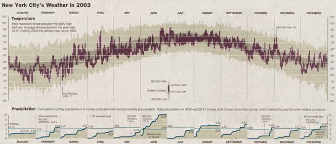
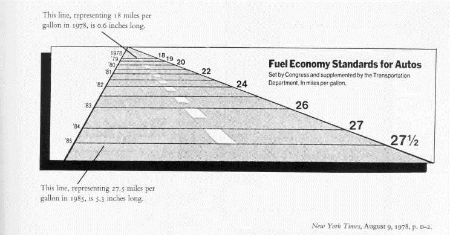
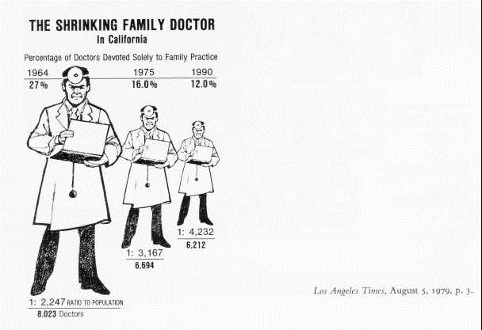
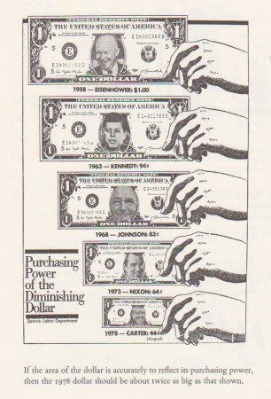
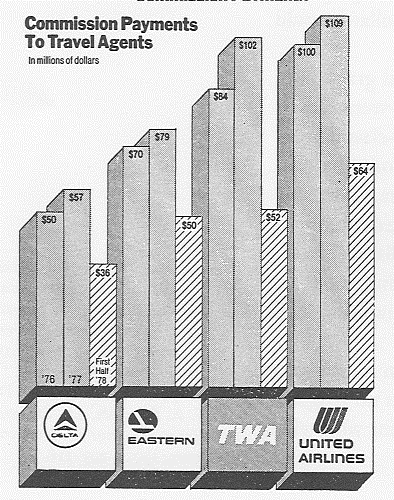
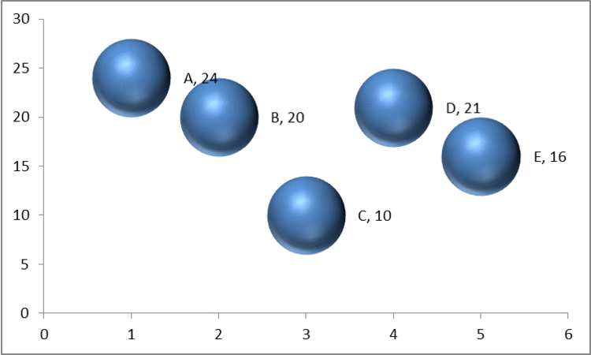

```{r global_options, echo=FALSE, include=FALSE}
library(knitr)
library(ggplot2)
library(gridExtra)
library(ggthemes)
library(reshape2)
library(dplyr)
library(sparkTable)
library(slopegraph)
library(scales)
opts_chunk$set(echo=FALSE, warning=FALSE, message=FALSE, fig.width=14, fig.height=7)
```


## Graphs versus Tables 

* Graphs for richer, more complex and more difficult statistical material. Show comparisons/relationships.
* If data can be summarized in one or two numbers, use numbers.
* Small, noncomparative, highly labeled datasets in tables.
* If datasets have 20 numbers or fewer, use tables

---

## Aesthetics and Technique

Graphical elegance is often found in simplicity of design and complexity of data

* Avoid sentence when having more than two numbers
* Tables are best to show exact numerical values.
* Pie-charts are dumb, series of them are dumber - never use them
* A supertable that permits many comparisons may be better than a series of little bar charts - Always?
* Mix words with graphics and tables. They have a single purpose - presentation of information.
* Avoid "See figure x". 
* Purpose of graphic - in exploratory data analysis, words should tell viewer how to read the design and not what to read in terms of content. (Other purposes could be description, tabulation, or decoration)
* Proportion and scale  
  * line weight and lettering
  * shape (tend towards horizontal) (1:1.4-1:1.8)

---

## Maximize Data-Ink Ratio 

* data-ink: Non-erasable core of a graphic
* non-data ink: erasable components of a graphic (e.g., axis lines, tick marks, labels...)
* data-ink ratio = (data-ink/total-ink)=(1-proportion of graphic that can be erased without loss of data-information)

For non-data-ink, less is more; For data-ink, less is a bore (Tufte credits Ludwig Mies van der Rohe and Robert Venturi)

---
## Improving data-ink by emphasizing data?

```{r echo=FALSE,warning=FALSE, message=FALSE}
light=ggplot(mtcars,aes(y=qsec,x=mpg))+stat_smooth(se=FALSE,color="black")+xlab("Miles per gallon") + ylab("Quarter mile time (in sec)")+theme(panel.grid.major = element_line(colour = "black"),panel.border=element_rect(fill=NA,colour="black"))
dark=ggplot(mtcars,aes(y=qsec,x=mpg))+stat_smooth(size=5,se=FALSE,color="black")+xlab("Miles per gallon") + ylab("Quarter mile time (in sec)")+theme(panel.grid.major = element_line(colour = "black"),panel.border=element_rect(fill=NA,colour="black"))
grid.arrange(light, dark, ncol=2)
```

---
## Background? White versus grey or any other color?

```{r echo=FALSE,warning=FALSE, message=FALSE}
grey=ggplot(mtcars,aes(y=qsec,x=mpg))+stat_smooth(se=FALSE,color="black")+xlab("Miles per gallon") + ylab("Quarter mile time (in sec)")+theme(panel.grid.major = element_line(colour = "black"),panel.border=element_rect(fill=NA,colour="black"))
white=ggplot(mtcars,aes(y=qsec,x=mpg))+stat_smooth(se=FALSE,color="black")+xlab("Miles per gallon") + ylab("Quarter mile time (in sec)")+theme(panel.grid.major = element_line(colour = "black"), panel.background = element_rect(fill = "white"),panel.border=element_rect(fill=NA,colour="black"))
grid.arrange(grey, white, ncol=2)

```

---
## Gridlines?

```{r echo=FALSE,warning=FALSE, message=FALSE}
gridy=ggplot(mtcars,aes(y=qsec,x=mpg))+stat_smooth(se=FALSE,color="black")+xlab("Miles per gallon") + ylab("Quarter mile time (in sec)")+theme(panel.grid.major = element_line(colour = "black"), panel.background = element_rect(fill = "white"),panel.grid.minor = element_blank(),panel.border=element_rect(fill=NA,colour="black"))
gridgrey=ggplot(mtcars,aes(y=qsec,x=mpg))+stat_smooth(se=FALSE,color="black")+xlab("Miles per gallon") + ylab("Quarter mile time (in sec)")+theme(panel.grid.major = element_line(colour = "grey",size=.5), panel.grid.minor = element_blank(),panel.background = element_rect(fill = "white"),panel.border=element_rect(fill=NA,colour="black"))

griddotted=ggplot(mtcars,aes(y=qsec,x=mpg))+stat_smooth(se=FALSE,color="black")+xlab("Miles per gallon") + ylab("Quarter mile time (in sec)")+theme(panel.grid.major = element_line(linetype="dotted",colour = "grey",size=.5), panel.grid.minor = element_blank(),panel.background = element_rect(fill = "white"),panel.border=element_rect(fill=NA,colour="black"))

gridno=ggplot(mtcars,aes(y=qsec,x=mpg))+stat_smooth(se=FALSE,color="black")+xlab("Miles per gallon") + ylab("Quarter mile time (in sec)")+theme(panel.grid.major = element_blank(), panel.grid.minor = element_blank(), panel.background = element_rect(fill = "white"),panel.border=element_rect(fill=NA,colour="black"))
grid.arrange(gridy, gridgrey, griddotted,gridno,ncol=2)
```

---
## Framing

```{r echo=FALSE,warning=FALSE, message=FALSE}
griddotted=ggplot(mtcars,aes(y=qsec,x=mpg))+stat_smooth(se=FALSE,color="black")+xlab("Miles per gallon") + ylab("Quarter mile time (in sec)")+theme(panel.grid.major = element_line(linetype="dotted",colour = "grey",size=.5), panel.grid.minor = element_blank(),panel.background = element_rect(fill = "white"),panel.border=element_rect(fill=NA,colour="black"))

griddottednoframe=ggplot(mtcars,aes(y=qsec,x=mpg))+stat_smooth(se=FALSE,color="black")+xlab("Miles per gallon") + ylab("Quarter mile time (in sec)")+theme(panel.grid.major = element_line(linetype="dotted",colour = "grey",size=.5), panel.grid.minor = element_blank(),panel.background = element_rect(fill = "white"))

grid.arrange(griddotted, griddottednoframe,ncol=2)
```

---
## Box plot
```{r echo=FALSE}
regbox=ggplot(mtcars, aes("", mpg)) + geom_boxplot()+theme_tufte()+xlab("")+ylab("Miles per gallon")
tuftebox=ggplot(mtcars, aes("", mpg))+geom_tufteboxplot()+theme_tufte()+xlab("")+ylab("Miles per gallon")
grid.arrange(regbox, tuftebox,ncol=2)
```

---
## Scatter plots

```{r echo=FALSE}
regscatter= ggplot(mtcars,aes(mpg,hp))+geom_point(color="tomato2")+theme_bw(base_family = "serif", base_size = 11)+xlab("Miles per gallon")+ylab("Horse power")
tufscatter=ggplot(mtcars,aes(mpg,hp))+geom_point(color="tomato2")+theme_tufte(ticks=FALSE)+ xlab("Miles per gallon")+ylab("Horse power")
tufrangescat=ggplot(mtcars,aes(mpg,hp))+geom_point(color="tomato2")+geom_rangeframe()+theme_tufte(ticks=FALSE)+xlab("Miles per gallon")+ylab("Horse power")
tufrangerugscat=ggplot(mtcars,aes(mpg,hp))+geom_point(color="tomato2")+theme_tufte(ticks=FALSE)+geom_rug()+xlab("Miles per gallon")+ylab("Horse power")  
grid.arrange(regscatter,tufscatter,tufrangescat,tufrangerugscat,ncol=2)
```

---
## Dot-dash plot + box-plots + means = Dot-dash-mean-box plots
Mean in blue and median in red

```{r echo=FALSE}
tufrangerugscat=ggplot(mtcars,aes(mpg,hp))+geom_point(color="tomato2")+theme_tufte(ticks=FALSE)+xlab("Miles per gallon")+ylab("Horse power")+ theme(plot.margin=unit(c(0,0,0,0),"mm")) +scale_x_continuous(breaks=c(15,30))+geom_rug() #used for alignment with points from the boxplots
hpbox=ggplot(mtcars,aes("",hp))+geom_tufteboxplot(ticks=FALSE,color="#A0A0A0")+theme_tufte(ticks=FALSE)+ylab("")+xlab(" ")+geom_point(aes("",mean(mtcars$hp)),color="blue",size=3)+theme(plot.margin=unit(c(0,0,0,0),"mm"))+geom_point(aes("",median(mtcars$hp)),color="red",size=3)+theme(axis.text = element_blank())#+geom_point(alpha=.4)

empty =  ggplot()+geom_point(aes(1,1), colour="white")+geom_blank()+theme_tufte()+xlab(" ")+ylab(" ")+theme(axis.text = element_blank())+theme(plot.margin=unit(c(0,0,0,0),"mm"))

mpgbox=ggplot(mtcars,aes("",mpg))+geom_tufteboxplot(ticks=FALSE,color="#A0A0A0")+theme_tufte(ticks=FALSE)+xlab(" ")+ylab("")+geom_point(aes("",mean(mtcars$mpg)),color="blue",size=3)+coord_flip()+theme(plot.margin=unit(c(0,0,0,5.75),"mm"))+geom_point(aes("",median(mtcars$mpg)),color="red",size=3)+theme(axis.text = element_blank())#+geom_point(alpha=.4)

grid.newpage()
vpscat=viewport(width = 1, height = 1, x = 0.5, y = 0.5)
vpx=viewport(width = 1, height = 0.2, x = .5, y = 0.05)
vpy=viewport(height=1,width=.2,y=0.5,x=0.05)

print(tufrangerugscat,vp=vpscat)
print(mpgbox,vp=vpx)
print(hpbox,vp=vpy)
```

---
## Dot-Dot Mean Box-plots
```{r echo=FALSE}
tufrangerugscat1=ggplot(mtcars,aes(mpg,hp))+geom_point(color="tomato2")+theme_tufte(ticks=FALSE)+xlab("Miles per gallon")+ylab("Horse power")+ theme(plot.margin=unit(c(0,0,0,0),"mm")) +scale_x_continuous(breaks=c(15,30))#+geom_rug() #used for alignment with points from the boxplots
hpbox1=ggplot(mtcars,aes("",hp))+geom_tufteboxplot(ticks=FALSE,color="#A0A0A0")+theme_tufte(ticks=FALSE)+ylab("")+xlab(" ")+geom_point(aes("",mean(mtcars$hp)),color="blue",size=3)+theme(plot.margin=unit(c(0,0,0,0),"mm"))+geom_point(aes("",median(mtcars$hp)),color="red",size=3)+theme(axis.text = element_blank())+geom_point(alpha=.4)

empty1 =  ggplot()+geom_point(aes(1,1), colour="white")+geom_blank()+theme_tufte()+xlab(" ")+ylab(" ")+theme(axis.text = element_blank())+theme(plot.margin=unit(c(0,0,0,0),"mm"))

mpgbox1=ggplot(mtcars,aes("",mpg))+geom_tufteboxplot(ticks=FALSE,color="#A0A0A0")+theme_tufte(ticks=FALSE)+xlab(" ")+ylab("")+geom_point(aes("",mean(mtcars$mpg)),color="blue",size=3)+coord_flip()+theme(plot.margin=unit(c(0,0,0,5.75),"mm"))+geom_point(aes("",median(mtcars$mpg)),color="red",size=3)+theme(axis.text = element_blank())+geom_point(alpha=.4)


grid.newpage()
vpscat1=viewport(width = 1, height = 1, x = 0.5, y = 0.5)
vpx1=viewport(width = 1, height = 0.2, x = .5, y = 0.05)
vpy1=viewport(height=1,width=.2,y=0.5,x=0.05)
print(tufrangerugscat1,vp=vpscat1)
print(mpgbox1,vp=vpx1)
print(hpbox1,vp=vpy1)
```

---
## Dot-Dotplots
```{r echo=FALSE}
tufrangerugscat2=ggplot(mtcars,aes(mpg,hp))+geom_point(color="tomato2")+theme_tufte(ticks=FALSE)+xlab("Miles per gallon")+ylab("Horse power")+ theme(plot.margin=unit(c(0,0,0,0),"mm")) +scale_x_continuous(breaks=c(15,30))#+geom_rug() #used for alignment with points from the boxplots

hpdot= ggplot(mtcars,aes(hp))+geom_dotplot(binwidth=2)+coord_flip()+theme_tufte(ticks=FALSE)+ylab("")+xlab("")+theme(plot.margin=unit(c(-1,0,1.5,0),"mm"))+theme(axis.text = element_blank())

mpgdot=  ggplot(mtcars,aes(mpg,""))+geom_dotplot(binwidth=.1)+theme_tufte(ticks=FALSE)+ylab("")+xlab("")+theme(plot.margin=unit(c(0,-1.5,0,4),"mm"))+theme(axis.text = element_blank())

grid.newpage()
vpscat2=viewport(width = 1, height = 1, x = 0.5, y = 0.5)
vpx2=viewport(width = 1, height = 0.2, x = .5, y = 0.1)
vpy2=viewport(height=1,width=.2,y=0.5,x=0.1)
print(tufrangerugscat2,vp=vpscat2)
print(mpgdot,vp=vpx2)
print(hpdot,vp=vpy2)
```

---
## Bar plots (dummy data)

```{r echo=FALSE}
gender=as.factor(rep(c("Male","Female"),25))
country=as.factor(rep(c("Country 1","Country 2","Country 3"),17)[-51])
df=data.frame(gender,country)
bartabledat = as.data.frame(table(df$gender,df$country)) ## get the cross tab
thick=ggplot(bartabledat,aes(x=Var1,fill=Var2,y=Freq))+geom_bar(stat="identity",position="dodge")+scale_fill_grey(name="")+theme_tufte(ticks=FALSE)+xlab("")+ylab("Number")+scale_y_continuous(breaks=c(2,4,6,8))+geom_hline(yintercept=seq(2, 8, 2), col="white", lwd=.5)+theme(legend.position="top")

thin=ggplot(bartabledat,aes(x=Var1,fill=Var2,y=Freq))+geom_bar(width=.025,stat="identity",position=position_dodge(width=.5))+theme_tufte(ticks=FALSE)+scale_fill_grey(name="")+xlab("")+ylab("Number")+scale_y_continuous(breaks=c(2,4,6,8))+geom_hline(yintercept=seq(2, 8, 2), col="white", lwd=2)+theme(legend.position="top")

grid.arrange(thick,thin,ncol=2)
```

---

## Multifunctioning Graphical Elements

* Mobilize every graphical element to show the data - can lead to complexity
```{r echo=FALSE}
X=1:8
Y=seq(28,14,-2)
ab=data.frame(X,Y)

ge1=ggplot(ab,aes(X,Y))+geom_point()

ge2=ggplot(ab,aes(X,Y))+geom_text(aes(X,Y),label=X)+theme(panel.grid.major = element_blank(), panel.grid.minor = element_blank(), panel.background = element_rect(fill = "white"),panel.border=element_blank(),axis.text.x = element_blank(),axis.ticks=element_blank())

ge3=ggplot(ab,aes(X,Y))+geom_text(aes(X,Y),label=X)+theme(panel.grid.major = element_blank(), panel.grid.minor = element_blank(), panel.background = element_rect(fill = "white"),panel.border=element_blank(),axis.text.x = element_blank(),axis.ticks=element_blank())+scale_y_continuous(breaks=ab$Y)

ge4=ggplot(ab,aes(x=reorder(X,Y),y=Y))+geom_segment(aes(x=reorder(X,Y),xend=reorder(X,Y),y=min(ab$Y)-2,yend=Y))+geom_segment(aes(x=0,xend=reorder(X,Y),y=Y,yend=Y))+theme(panel.grid.major = element_blank(), panel.grid.minor = element_blank(), panel.background = element_rect(fill = "white"),panel.border=element_blank(),axis.ticks=element_blank())+scale_y_continuous(breaks=ab$Y,limits=c(min(ab$Y)-2,max(ab$Y)))+xlab("X")

grid.arrange(ge1,ge2, ge3, ge4, ncol=2)
```

---
## Slopegraph

```{r echo=FALSE}

data(gdp)

slopegraph(gdp, col.line='gray', labels=c('1970','1979'), 
    main=paste('Current Receipts of Government as a','Percentage of Gross Domestic Product',sep="\n"),
    binval=3.75)

```

---
## High Data Density plots
data density = number of entries in data array/area of data graphic
 <br>
300 numbers per square inch

---

## Small Multiples

Collections of mini figures arranged to portray a single animated figure (e.g.,Gelman's voucher map) <br>


---
## Sparklines - Word-sized graphics - Example, change in population of Austria (1981-2009)

```{r echo=FALSE,results='asis'}
library(sparkTable)
#Population
data(pop)
levels(pop$variable)=c("Age 0-19","Age 20-64","Age 65+","Age 75+","Women","Total","Men","Men per 1000 Women")
b <- newSparkBox()
l <- newSparkLine()
bb <- newSparkBar()
content <- list(function(x) { round(mean(x),2) },
b,l,bb,
function(x) { round(tail(x,1),2) })
names(content) <- c("Mean","Boxplot","LinePlot","BarPlot","Current value")
varType <- rep("value",5)
pop <- pop[,c("variable","value","time")]
pop$time <- as.numeric(as.character(pop$time))
xx <- reshapeExt(pop,idvar="variable", varying=list(2))
x1 <- newSparkTable(xx, content, varType)
plotSparkTable(x1, outputType="html", graphNames="out1")
```

---

## Deception in Graphs

* Truth telling - bars with a zero base
* Comparison of equal time frames (4 quarters in a year versus 2 quarters in another year)
* Distortion of graphic: Visual representation of data not consistent with numerical representation of data 
  * lie factor = size of effect shown in graphic /size of effect in data; .95-1.5 good, 1, best.
* Show variations in data and do not introduce variations in design of chart (3D needed?)
* In time series displays of money, use deflated and standardized units of monetary measurements over nominal units.
* Distortion by using areas to show one-dimensional data - (a) ambiguities in perception of 2D surfaces to convert to a one-D number; (b) changes in physical areas do not produce proportional changes in perceived areas. The number of information-carrying dimensions (variables) in graphics should not exceed number of dimensions in data.

---
## Deception: Zero Base in Bar Charts

```{r echo=FALSE}
dfcyl=data.frame(table(mtcars$cyl))
bars0=ggplot(dfcyl,aes(Var1,Freq))+geom_bar(stat="identity")+xlab("Number of Cylinders")+ylab("Number of Motor Vehicles")
bars7=ggplot(dfcyl,aes(Var1,Freq))+geom_bar(stat="identity")+xlab("Number of Cylinders")+ylab("Number of Motor Vehicles")+scale_y_continuous(limits=c(7,14),oob=rescale_none)
grid.arrange(bars0,bars7,ncol=2)
```

---
## Lie factor of 14.8



---

## Lie factor of 9.4


---

## Lie factor of 2.8 (plus other issues)



---

## Using multiple dimensions to depict one dimensional change


   
Surface area of 1978 dollar should've been twice as big as shown to reflect purchasing power change

---

## Time frame deception



---

## Chartjunk

* Vibration and movement in optics: Design interactions with physiological tremor of eye
  + Use shades of gray when color fills not advisable
  + label with words than create cross-hatched designs

* Gridlines: None versus shades of grey?

---

## Categorical Variable ---Use fills!
```{r echo=FALSE}

layout(rbind(1,2), heights=c(7,1))  # put legend on bottom 1/8th of the chart
barplot(VADeaths, beside=TRUE,angle = 15+20*1:5,density = 20, col = "black",main="Death rates per 1000 in Virginia in 1940" )
par(mar=c(0, 0, 0, 0))
plot.new()
legend('top',rownames(VADeaths),angle = 15+20*1:5, density = 20, col = "black",ncol=4,bty ="n")
```

---

## Avoid



---

## Acknowledgement for images, content used in the presentation, and code for presentation

https://github.com/patilv/04-DesignofGraphs

