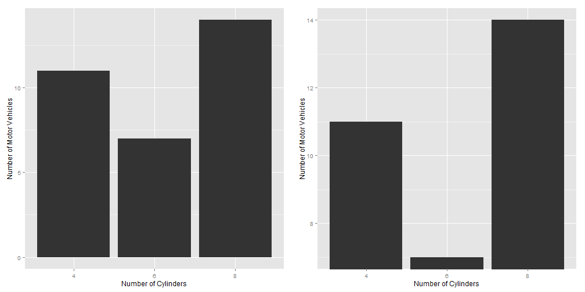

## Graphs versus Tables 

* Graphs for richer, more complex and more difficult statistical material. Show comparisons/relationships.
* If data can be summarized in one or two numbers, use numbers.
* Small, noncomparative, highly labeled datasets in tables.
* If datasets have 20 numbers or fewer, use tables

---

## Aesthetics and Technique

Graphical elegance is often found in simplicity of design and complexity of data

* Avoid sentence when having more than two numbers
* Tables are best to show exact numerical values.
* Pie-charts are dumb, series of them are dumber - never use them
* A supertable that permits many comparisons may be better than a series of little bar charts - Always?
* Mix words with graphics and tables. They have a single purpose - presentation of information.
* Avoid "See figure x". 
* Purpose of graphic - in exploratory data analysis, words should tell viewer how to read the design and not what to read in terms of content. (Other purposes could be description, tabulation, or decoration)
* Proportion and scale  
  * line weight and lettering
  * shape (tend towards horizontal) (1:1.4-1:1.8)

---

## Maximize Data-Ink Ratio 

* data-ink: Non-erasable core of a graphic
* non-data ink: erasable components of a graphic (e.g., axis lines, tick marks, labels...)
* data-ink ratio = (data-ink/total-ink)=(1-proportion of graphic that can be erased without loss of data-information)

For non-data-ink, less is more; For data-ink, less is a bore (Tufte credits Ludwig Mies van der Rohe and Robert Venturi)

---
## Improving data-ink by emphasizing data?

 

---
## Background? White versus grey or any other color?

 

---
## Gridlines?

 

---
## Framing

 

---
## Box plot
 

---
## Scatter plots

 

---
## Dot-dash plot + box-plots + means = Dot-dash-mean-box plots
Mean in blue and median in red

 

---
## Dot-Dot Mean Box-plots
 

---
## Dot-Dotplots
 

---
## Bar plots (dummy data)

 

---

## Multifunctioning Graphical Elements

* Mobilize every graphical element to show the data - can lead to complexity
 

---
## Slopegraph

 

---
## High Data Density plots
data density = number of entries in data array/area of data graphic
  
300 numbers per square inch

---

## Small Multiples

Collections of mini figures arranged to portray a single animated figure (e.g.,Gelman's voucher map)  

---
## Sparklines - Word-sized graphics - Example, change in population of Austria (1981-2009)

<!-- html table generated in R 3.1.1 by xtable 1.7-4 package -->
<!-- Tue Sep 23 16:29:13 2014 -->
<table border=1>
<tr> <th>  </th> <th> Mean </th> <th> Boxplot </th> <th> LinePlot </th> <th> BarPlot </th> <th> Current value </th>  </tr>
  <tr> <td align="right"> Total </td> <td> 7884750.66 </td> <td>  </td> <td>  </td> <td>  </td> <td> 8355260 </td> </tr>
  <tr> <td align="right"> Men </td> <td> 3791573.55 </td> <td>  </td> <td>  </td> <td>  </td> <td> 4068047 </td> </tr>
  <tr> <td align="right"> Women </td> <td> 4093177.1 </td> <td>  </td> <td>  </td> <td>  </td> <td> 4287213 </td> </tr>
  <tr> <td align="right"> Men per 1000 Women </td> <td> 925.97 </td> <td>  </td> <td>  </td> <td>  </td> <td> 949 </td> </tr>
  <tr> <td align="right"> Age 0-19 </td> <td> 1899456.83 </td> <td>  </td> <td>  </td> <td>  </td> <td> 1763948 </td> </tr>
  <tr> <td align="right"> Age 20-64 </td> <td> 4778240 </td> <td>  </td> <td>  </td> <td>  </td> <td> 5140425 </td> </tr>
  <tr> <td align="right"> Age 65+ </td> <td> 1207053.83 </td> <td>  </td> <td>  </td> <td>  </td> <td> 1450887 </td> </tr>
  <tr> <td align="right"> Age 75+ </td> <td> 541649.59 </td> <td>  </td> <td>  </td> <td>  </td> <td> 665415 </td> </tr>
   </table>
<!-- .html was created.-->

---

## Deception in Graphs

* Truth telling - bars with a zero base
* Comparison of equal time frames (4 quarters in a year versus 2 quarters in another year)
* Distortion of graphic: Visual representation of data not consistent with numerical representation of data 
  * lie factor = size of effect shown in graphic /size of effect in data; .95-1.5 good, 1, best.
* Show variations in data and do not introduce variations in design of chart (3D needed?)
* In time series displays of money, use deflated and standardized units of monetary measurements over nominal units.
* Distortion by using areas to show one-dimensional data - (a) ambiguities in perception of 2D surfaces to convert to a one-D number; (b) changes in physical areas do not produce proportional changes in perceived areas. The number of information-carrying dimensions (variables) in graphics should not exceed number of dimensions in data.

---
## Deception: Zero Base in Bar Charts

 

---
## Lie factor of 14.8

---

## Lie factor of 9.4

---

## Lie factor of 2.8 (plus other issues)

---

## Using multiple dimensions to depict one dimensional change

   
Surface area of 1978 dollar should've been twice as big as shown to reflect purchasing power change

---

## Time frame deception

---

## Chartjunk

* Vibration and movement in optics: Design interactions with physiological tremor of eye
  + Use shades of gray when color fills not advisable
  + label with words than create cross-hatched designs

* Gridlines: None versus shades of grey?

---

## Categorical Variable ---Use fills!
 

---

## Avoid

---

## Acknowledgement for images, content used in the presentation, and code for presentation

https://github.com/patilv/04-DesignofGraphs

